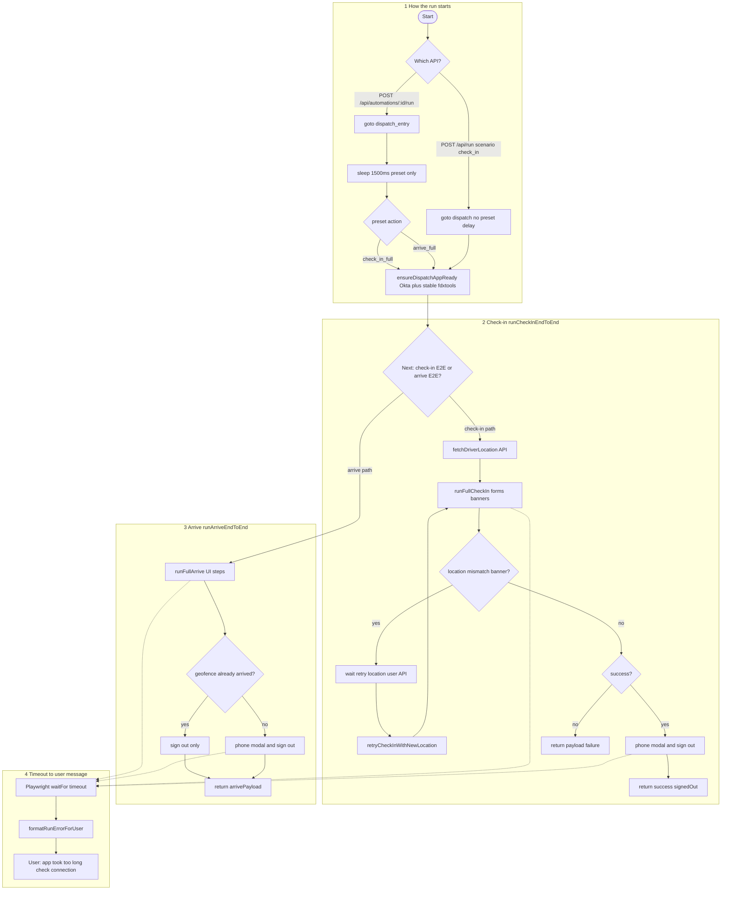
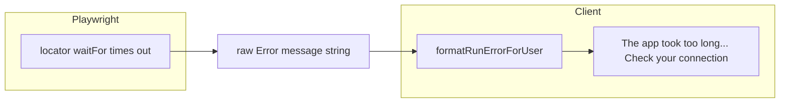
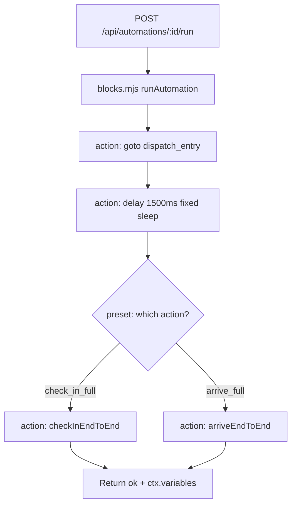
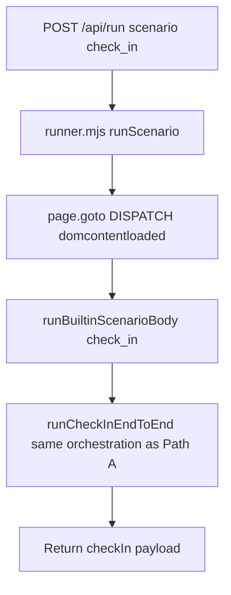
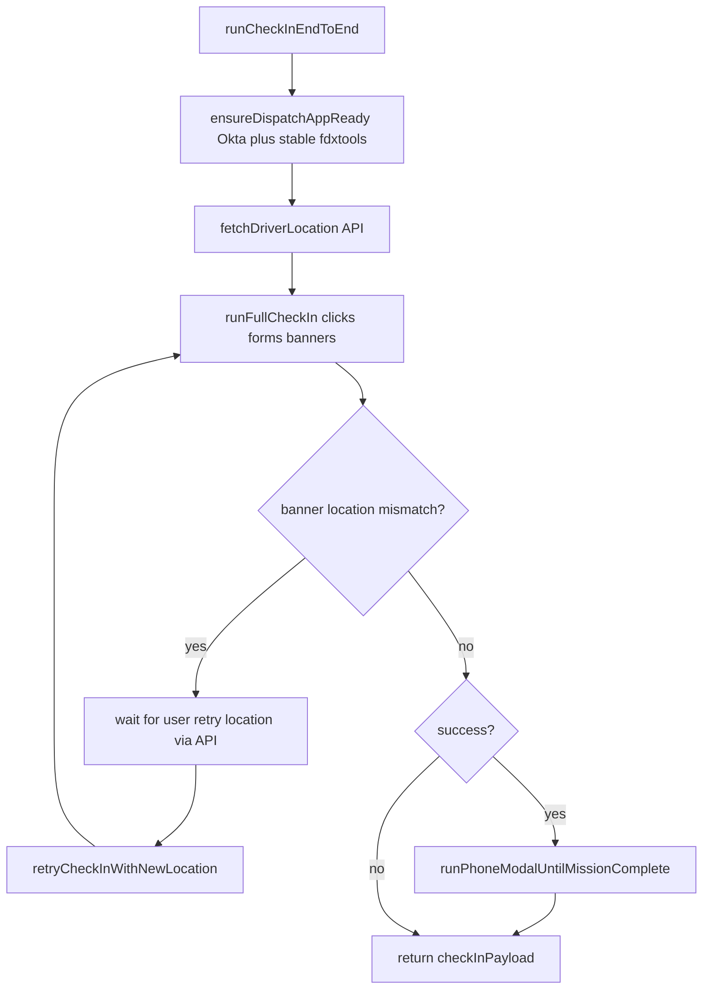
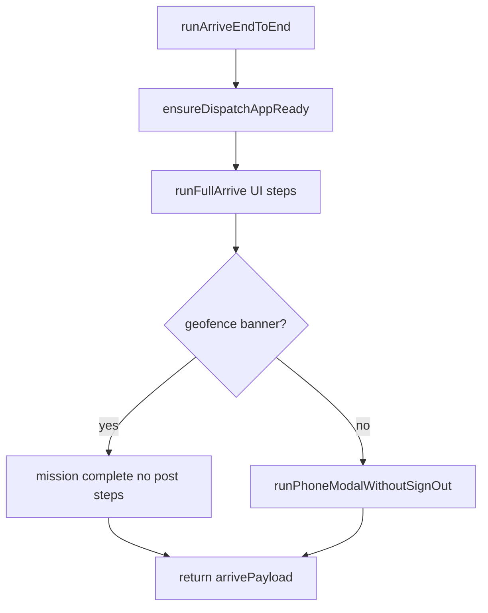
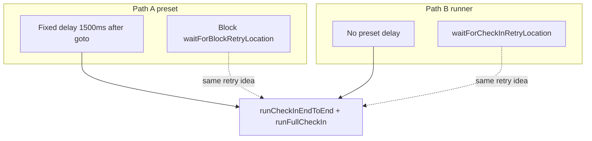

# Check-in and Arrive automation — overview

This note explains the two run paths and the “connection” error. **Graphs below are [Mermaid](https://mermaid.js.org/)** — the same diagram language Cursor uses in **Plan mode** (flowcharts render when you open Markdown preview in Cursor, VS Code with a Mermaid extension, or GitHub).

**Single combined chart (copy into [mermaid.live](https://mermaid.live)):** see [`automation-checkin-arrive-unified.mermaid`](automation-checkin-arrive-unified.mermaid) in this folder, or the fenced block below.

### One diagram — check-in + arrive logic together

`POST /api/run` with `check_in` always continues down the **check-in** branch after `ensureDispatchAppReady` (the diamond is only choosing arrive vs check-in for **preset** runs; the runner never takes the arrive branch).

---

## 0. Visual graphs (Mermaid — Plan-style flowcharts)

### How the user-facing “connection” error is produced

### Path A — Block automation preset (Check-in or Arrive)

### Path B — Scenario runner check_in only

### Inside checkInEndToEnd (both paths share this)

### Inside arriveEndToEnd

### Path A vs Path B — what differs for check-in

---

## 1. Why the app says “check your connection” so often

The UI text **“The app took too long to load. Check your connection and try again.”** is shown when Playwright throws a **timeout while waiting for a button, banner, or other element**. That is wired in `src/utils/runErrorFormat.js`: it is **not** a network test. Slow Wi‑Fi can contribute, but the same message appears when:

- The FedEx page is still loading or Angular has not painted the control yet.
- An XPath or selector no longer matches the real page.
- A modal or banner is blocking the next step.
- You are still on PurpleID / Okta sign-in (different error in some paths, but timeouts still map to this friendly line).

So treat that message as **“something in the browser automation did not become ready in time,”** not necessarily a broken connection.

---

## 2. Two different ways a check-in or arrive run starts

**Path A — Automation from the dashboard (saved automation / preset)**  
Server: `POST /api/automations/:id/run` → code in `server/playwright/blocks.mjs`.

**Path B — Built-in scenario runner**  
Server: `POST /api/run` with body `scenario: "check_in"` → code in `server/playwright/runner.mjs`.

Both paths eventually call the **same core check-in logic** (`runCheckInEndToEnd` in `server/playwright/checkInOrchestration.mjs`) when you want a **full** check-in. They differ in **how the browser page is opened** and **how “retry with a new location”** is wired (two separate wait helpers: one for the scenario runner, one for block automations).

**Full Arrive** (tractor selection, confirm, phone, sign-out) is implemented as the block action **`arriveEndToEnd`** in `blocks.mjs`, not as the tiny **`scenario: "arrive"`** step in the runner (that scenario only tries to click “Arrive” from the menu once).

---

## 3. Path A — Block automation (typical preset: Full Check-In or Full Arrive)

Order of steps as defined in `server/automation-presets.mjs`:

1. **goto** — Open the dispatch home URL (`dispatch_entry`), wait until `domcontentloaded`, long navigation timeout.
2. **delay** — Wait a **fixed number of milliseconds** (1500 in the presets). This is a plain timer. It does **not** wait for a specific button to exist.
3. **checkInEndToEnd** or **arriveEndToEnd** — Runs the real flow (see sections 5 and 6 below).

Inside **checkInEndToEnd** (orchestration file `checkInOrchestration.mjs`):

1. **ensureDispatchAppReady** — Waits until you are on the real FedEx dispatch app (and can drive Okta sign-in if configured). This part is “content aware” (URL and stability), not a single fixed delay for the whole page.
2. Read **tractor** from saved credentials; read **driver location** from the Linehaul API (not only from a saved assignment field).
3. **runFullCheckIn** (`checkInFlow.mjs`) — Clicks through Begin New Check In, Check In, fills form, submits. Uses **waitFor visible** timeouts and polling for banners (see section 5).
4. If the FedEx banner indicates **location mismatch**, the run can **pause** and wait for the user to submit a **new location** via the API (retry), then retry check-in with that location.
5. On success, run **`runPhoneModalUntilMissionComplete`** (`postCheckInFlow.mjs`) — phone / Linehaul / assistance as needed, poll for mission-complete text; **no** automated sign-out.

Inside **arriveEndToEnd** (`arriveOrchestration.mjs`):

1. **ensureDispatchAppReady** (same idea as check-in).
2. **runFullArrive** (`arriveFlow.mjs`) — Arrive button, select tractor, fill number, continue, then confirm arrival or detect geofence message.
3. If **geofence** already arrived: **no** post steps (no automated sign-out). Else: require **phone** in assignment and run **phone modal → Linehaul → assistance** via `runPhoneModalWithoutSignOut` (no automated sign-out; session may stay signed in).

---

## 4. Path B — POST /api/run with scenario check_in

Order of steps in `runner.mjs`:

1. Start browser context and open the dispatch **entry URL** once (`page.goto`, `domcontentloaded`).
2. Call the built-in body for **`check_in`**, which calls **`runCheckInWithLocationRetries`** → same **`runCheckInEndToEnd`** as Path A (including **ensureDispatchAppReady** inside it).
3. Location retry uses the **runner’s** pending “wait for retry location” helper (not the block runner’s), but the **business steps** match.

There is **no** preset-style **1500 ms delay** in this path before check-in starts; only the navigation wait.

---

## 5. What “content aware” means in checkInFlow (runFullCheckIn)

Not a chart—just the idea:

- Waits use **Playwright** `waitFor` on locators (visible / attached) with **time limits** (often tens of seconds).
- “Begin new check-in” has a **loop** that polls until the control looks disabled (session ready), up to a cap.
- After submit, the code **polls the banner** for a short window to read success vs location mismatch text.
- XPath strings can be **customized** from stored flow settings (`check-in-flow-store`), so behavior depends on **selectors matching the live FedEx UI**.

Fixed **sleep** calls exist in places (short waits between steps). The **preset delay** before `checkInEndToEnd` is entirely **not** tied to a specific element.

---

## 6. What runFullArrive does differently

- Many steps use **waitFor visible** on XPath-based locators, with fallbacks (e.g. menu click if the main button is not found).
- There are **explicit short sleeps** (for example after navigation) so the next screen can render; those are **time-based**, not “wait until this exact selector is stable.”
- Geofence is detected by reading **body text** for a known phrase.

---

## 7. Where to look in the repo

| Topic | File |
|-------|------|
| Friendly “connection” error mapping | `src/utils/runErrorFormat.js` |
| Block actions: goto, delay, checkInEndToEnd, arriveEndToEnd | `server/playwright/blocks.mjs` |
| Preset action order | `server/automation-presets.mjs` |
| Scenario run (check_in) | `server/playwright/runner.mjs` |
| Check-in orchestration | `server/playwright/checkInOrchestration.mjs` |
| Check-in UI steps | `server/playwright/checkInFlow.mjs` |
| Arrive orchestration | `server/playwright/arriveOrchestration.mjs` |
| Arrive UI steps | `server/playwright/arriveFlow.mjs` |
| Dispatch / Okta gate | `server/playwright/dispatchAuthGate.mjs` |
| After check-in: phone → mission text (no sign-out); arrive: `runPhoneModalWithoutSignOut` | `server/playwright/postCheckInFlow.mjs` |

---

## 8. Short summary

- **Path A (dashboard automation)** adds a **fixed delay** after load, then the same end-to-end check-in or arrive logic as **Path B** for check-in.
- **“Connection” errors** usually mean **automation timed out waiting for the page or a control**, not a verified network fault.
- Improving reliability generally means **stronger waits tied to real UI state** and **accurate selectors**, not only longer blind delays.
