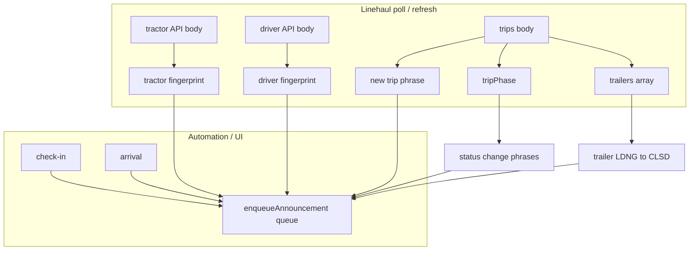

# TTS / announcement trigger structure

Purpose: map **what event** in the app leads to **which spoken phrase**, which **prefs** gate it, and where it is implemented. All runtime alerts use the unified queue in [`src/utils/alertAudioQueue.js`](../src/utils/alertAudioQueue.js) (`enqueueAnnouncement`), except **Settings test** paths that use `speakDirect` (user gesture).

---

## Global behavior

| Setting | Storage key | Effect |
|--------|---------------|--------|
| Trip alert mode | `fedexTripAlertMode` | `off` \| `tts` \| `both` — `both` plays bell then TTS (per item). |
| Trip status changes | `fedexTripStatusChangeEnabled` | Assigned / dispatched / completed phrases. |
| Trailer status changes | `fedexTrailerStatusChangeEnabled` | LDNG → CLSD per trailer. |
| Arrival alerts | `fedexArrivalAlertsEnabled` | Arrival success + geofence arrival. |
| Alert prefs (tractor/driver/check-in/API) | `fedexAlertPrefs` | `tractorChange`, `driverChange`, `checkIn`, `apiReconnect` (defaults: first three on, API reconnect off). |

Queue: items play **one after another** (wait for `SpeechSynthesisUtterance` `onend`). Same **category** within **2s** dedupes to the latest text.

---

## Triggers (by source)

### A. [`MainDashboard.vue`](../src/views/MainDashboard.vue) — Linehaul data watches

| Watch / call | When it fires | Announcement | Queue category / notes |
|--------------|----------------|--------------|-------------------------|
| `linehaulTractorBody` (deep) | Fingerprint of `locationId`, `tractorNbr`, `tractorDomicileAbbrv`, `detlCodeActvStat`, `detlCodeAvailStat` **changes** after both old and new exist | "Tractor details updated." | `tractorChange` — gated by `fedexAlertPrefs.tractorChange` |
| `linehaulDriverBody` (deep) | Fingerprint of `driverLocation`, `driverActvStat`, `driverAvlStat` **changes** after both old and new exist | "Driver details updated." | `driverChange` — gated by `fedexAlertPrefs.driverChange` |
| `[linehaulTripsBody, linehaulTripsNoActive]` | After each refresh | See **New trip** below | `newTrip:<origin>\|\|\|<dest>` |
| `tripPhase` (computed) | Phase string changes; **first** transition has no announcement (no `prev`) | See **Trip phase** below | `statusChange:<phase>` |
| `trailers` from `linehaulTripsBody` (deep) | Per trailer row | See **Trailer** below | `trailer:<trlrOrder>` |
| Live log / automation handlers | Check-in / arrival automation messages | See **Automation** below | various |

### B. Trip phase ([`linehaulSnapshotStore.js`](../src/stores/linehaulSnapshotStore.js) — `tripPhase`)

Computed value: `'none' \| 'assigned' \| 'dispatched'`.

| Condition | Phase |
|-----------|--------|
| `tripStatus === 'DSPCH'` **or** driver `driverAvlStat === 'ENRT'` **or** tractor `detlCodeAvailStat === 'ENRT'` | `dispatched` |
| `tripStatus === 'APRVD'` and trip body present | `assigned` |
| Trip body present but not matching above | `assigned` |
| Else | `none` |

[`maybeAnnounceStatusChange`](../src/utils/tripVoiceAnnouncement.js) only speaks after an **initial** phase was stored; then on transition:

| New phase (from previous) | Spoken text |
|---------------------------|-------------|
| → `assigned` (and prev was not assigned) | "Trip status changed to assigned." |
| → `dispatched` (and prev was not dispatched) | "Trip status changed to dispatched." |
| → `none` (and prev was not none) | "Trip completed." |

Gated: trip mode not `off`, and `fedexTripStatusChangeEnabled` !== `'false'`.

### C. New trip ([`maybeAnnounceNewTrip`](../src/utils/tripVoiceAnnouncement.js))

| Condition | Spoken text |
|-----------|-------------|
| Active trip, origin+destination present, fingerprint **new** vs last announced | "New trip ready from &lt;origin&gt; to &lt;destination&gt;." |
| `noActiveTrip` or null body | Clears internal fingerprint; no speech |

Gated: mode not `off`. On touch devices, may queue until user taps **unlock** (`unlockTripVoiceFromUserGesture`).

### D. Trailer ([`maybeAnnounceTrailerStatusChange`](../src/utils/tripVoiceAnnouncement.js))

| Transition (per `trlrOrder`) | Spoken text |
|--------------------------------|-------------|
| Previous `detlCodeLoadStatus` was `LDNG`, now `CLSD` | "Trailer &lt;order&gt; has finished loading and is now closed." |

Gated: mode not `off`, `fedexTrailerStatusChangeEnabled` !== `'false'`.

### E. Arrival ([`tripVoiceAnnouncement.js`](../src/utils/tripVoiceAnnouncement.js))

| Function | Spoken text | Gated by |
|----------|-------------|----------|
| `announceArrivalSuccess` | "Arrived at destination successfully." | Mode not `off`, arrival alerts enabled |
| `announceGeofenceArrival` | "Tractor already arrived by geofence." | Same |

Called from [`MainDashboard.vue`](../src/views/MainDashboard.vue) and [`AutomationList.vue`](../src/components/automation/AutomationList.vue) when automation/live-log indicates arrival / geofence.

### F. Check-in and API ([`alertAudioQueue.js`](../src/utils/alertAudioQueue.js))

| Function | Spoken text | Pref key |
|----------|-------------|----------|
| `announceCheckInSuccess` | "Check-in successful." | `checkIn` |
| `announceCheckInFail` | "Check-in failed." | `checkIn` |
| `announceCheckInTripReady` | "Check in successful. Trip ready and acknowledged." | `checkIn` |
| `announceCheckInNewTrip` | "Check-in successful, new trip found" (trip summary + Begin inspection page) | `checkIn` |
| `announceApiReconnect` | "API reconnected." | `apiReconnect` (default **false**) |

`announceApiReconnect` is exported but **not wired** to any caller in the repo as of this doc (available for future reconnect hooks).

---

## Flow (high level)

---

## Files reference

| Concern | File |
|---------|------|
| Queue + tractor/driver/check-in/API | `src/utils/alertAudioQueue.js` |
| Trip prefs, new trip, phase, trailer, arrival | `src/utils/tripVoiceAnnouncement.js` |
| `tripPhase` computation | `src/stores/linehaulSnapshotStore.js` |
| Watches + automation routing | `src/views/MainDashboard.vue`, `src/components/automation/AutomationList.vue` |

---

## One-line summary

**Linehaul:** tractor/driver fingerprint change → update phrases; trips → new trip + phase + trailer LDNG→CLSD; **Automation:** check-in / arrival / geofence → corresponding phrases; **all** join the same sequential TTS queue unless using Settings **Test** (`speakDirect`).
